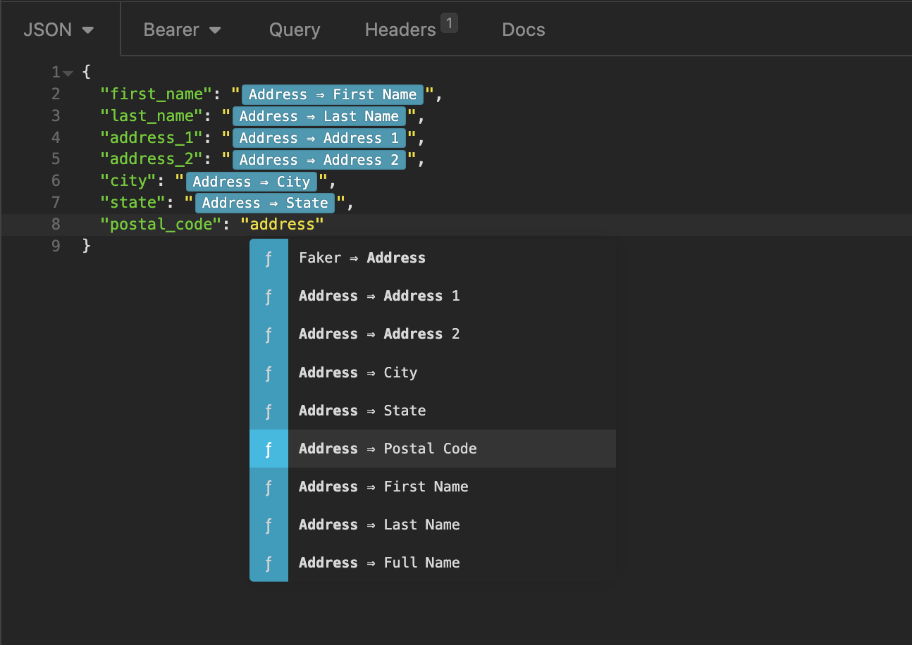
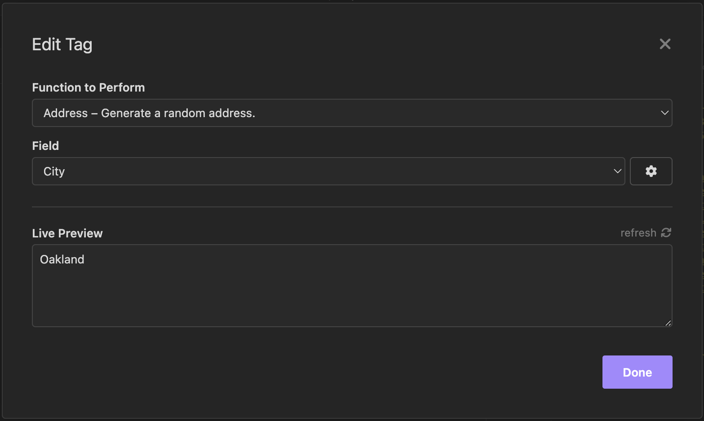

# Insomnia Real Address Data Plugin
Generate address data from within the Insomnia Rest client. The addresses generated are real, random addresses that will geocode and pass address validation.

The address data comes from [EthanRBrown/rrad](https://github.com/EthanRBrown/rrad) with name fields randomly generated using [Faker](https://github.com/faker-js/faker)

### Screenshots

### Available Fields
- Address 1
- Address 2
- City
- State
- Postal Code
- First Name
- Last Name
- Full Name
